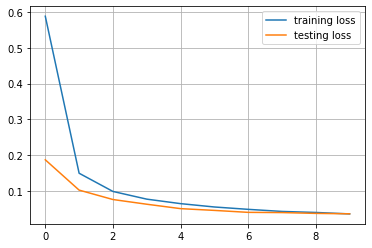

# MNIST


```python
import torch.nn as nn
import torch.optim as optim
from torchvision import transforms

from src.data import MNIST
from src.models import LeNet
from src.training.config import TrainingConfig
from src.training import ModelTrainer
import matplotlib.pyplot as plt
```


```python
training_config = TrainingConfig(batch_size=100, lr=0.0001)
```


```python
model = LeNet()
```


```python
transform = transforms.Compose([
    transforms.Resize((28,28)),
    transforms.ToTensor(),
    transforms.Normalize((0.5,), (0.5,))
])
```


```python
training_data = MNIST(train=True, root='./data', transform=transform)
testing_data = MNIST(train=False, root='./data', transform=transform)
```

    C:\Users\raghu\anaconda3\envs\CV\lib\site-packages\torchvision\datasets\mnist.py:498: UserWarning: The given NumPy array is not writeable, and PyTorch does not support non-writeable tensors. This means you can write to the underlying (supposedly non-writeable) NumPy array using the tensor. You may want to copy the array to protect its data or make it writeable before converting it to a tensor. This type of warning will be suppressed for the rest of this program. (Triggered internally at  ..\torch\csrc\utils\tensor_numpy.cpp:180.)
      return torch.from_numpy(parsed.astype(m[2], copy=False)).view(*s)
    


```python
len(training_data), len(testing_data)
```


    (60000, 10000)


```python
model_trainer = ModelTrainer(
    model,
    optim.Adam,
    nn.CrossEntropyLoss(),
    training_config,
    training_data,
    cuda=True,
    validation_data=testing_data
)
```

    using NVIDIA GeForce GTX 1060
    


```python
training_metrics, testing_metrics = model_trainer.train(10, True)
```

    C:\Users\raghu\anaconda3\envs\CV\lib\site-packages\torch\nn\functional.py:718: UserWarning: Named tensors and all their associated APIs are an experimental feature and subject to change. Please do not use them for anything important until they are released as stable. (Triggered internally at  ..\c10/core/TensorImpl.h:1156.)
      return torch.max_pool2d(input, kernel_size, stride, padding, dilation, ceil_mode)
    

    training metrics:   epoch: 0  loss: 0.5660764900470774      accuracy: 84.745              
    testing metrics:    epoch: 0  loss: 0.17687464848160744     accuracy: 94.9                
    training metrics:   epoch: 1  loss: 0.149194760688891       accuracy: 95.60166666666667   
    testing metrics:    epoch: 1  loss: 0.10237489618360997     accuracy: 97.04               
    training metrics:   epoch: 2  loss: 0.09915908887982368     accuracy: 97.025              
    testing metrics:    epoch: 2  loss: 0.07482448821887373     accuracy: 97.77               
    training metrics:   epoch: 3  loss: 0.0767439952896287      accuracy: 97.70166666666667   
    testing metrics:    epoch: 3  loss: 0.060018064426258205    accuracy: 98.27               
    training metrics:   epoch: 4  loss: 0.06538150800547252     accuracy: 98.03666666666666   
    testing metrics:    epoch: 4  loss: 0.05361601756885648     accuracy: 98.43               
    training metrics:   epoch: 5  loss: 0.05587025833937029     accuracy: 98.27333333333333   
    testing metrics:    epoch: 5  loss: 0.04519161452539265     accuracy: 98.64               
    training metrics:   epoch: 6  loss: 0.04881695498013869     accuracy: 98.53166666666667   
    testing metrics:    epoch: 6  loss: 0.045814448073506354    accuracy: 98.52               
    training metrics:   epoch: 7  loss: 0.04415119583640868     accuracy: 98.65               
    testing metrics:    epoch: 7  loss: 0.03866033910308033     accuracy: 98.81               
    training metrics:   epoch: 8  loss: 0.03902378518444796     accuracy: 98.84               
    testing metrics:    epoch: 8  loss: 0.03777801387012005     accuracy: 98.72               
    training metrics:   epoch: 9  loss: 0.03686355788144283     accuracy: 98.91333333333333   
    testing metrics:    epoch: 9  loss: 0.033952858552802355    accuracy: 98.91               
    


```python
plt.plot(training_metrics.losses, label='training loss')
plt.plot(testing_metrics.losses, label='testing loss')
plt.grid()
plt.legend()
```


    <matplotlib.legend.Legend at 0x21f38f44220>


    

    


```python
plt.plot(training_metrics.accuracies, label='training accuracy')
plt.plot(testing_metrics.accuracies, label='testing accuracy')
plt.grid()
plt.legend()
```


    <matplotlib.legend.Legend at 0x21f14ba1b20>


    

    


```python
import requests
from PIL import Image, ImageOps

url = 'https://images.homedepot-static.com/productImages/007164ea-d47e-4f66-8d8c-fd9f621984a2/svn/architectural-mailboxes-house-letters-numbers-3585b-5-64_1000.jpg'
response = requests.get(url, stream = True)
img = Image.open(response.raw)
plt.imshow(img)
```


    <matplotlib.image.AxesImage at 0x21f27b61790>


    

    


```python
img = ImageOps.invert(ImageOps.grayscale(img))
img = img.convert('1')
img = transform(img)
```


```python
import torch

device = torch.device('cuda:0')
images = img.to(device)
image = images[0].unsqueeze(0).unsqueeze(0)
output = model.predict(image)
print(output)
```

    5
    


```python

```
