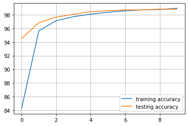
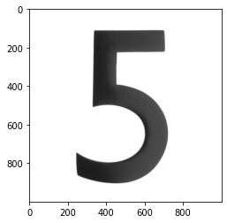

# MNIST


```python
import torch.nn as nn
import torch.optim as optim
from torchvision import transforms

from src.data import MNIST
from src.models import LeNet
from src.training.config import TrainingConfig
from src.training import ModelTrainer
import matplotlib.pyplot as plt
```


```python
training_config = TrainingConfig(batch_size=100, lr=0.0001)
```


```python
model = LeNet()
```


```python
transform = transforms.Compose([
    transforms.Resize((28, 28)),
    transforms.ToTensor(),
    transforms.Normalize((0.5,), (0.5,))
])
```


```python
training_data = MNIST(train=True, root='./data', transform=transform)
testing_data = MNIST(train=False, root='./data', transform=transform)
```

    C:\Users\raghu\anaconda3\envs\CV\lib\site-packages\torchvision\datasets\mnist.py:498: UserWarning: The given NumPy array is not writeable, and PyTorch does not support non-writeable tensors. This means you can write to the underlying (supposedly non-writeable) NumPy array using the tensor. You may want to copy the array to protect its data or make it writeable before converting it to a tensor. This type of warning will be suppressed for the rest of this program. (Triggered internally at  ..\torch\csrc\utils\tensor_numpy.cpp:180.)
      return torch.from_numpy(parsed.astype(m[2], copy=False)).view(*s)
    


```python
len(training_data), len(testing_data)
```


    (60000, 10000)


```python
model_trainer = ModelTrainer(
    model,
    optim.Adam,
    nn.CrossEntropyLoss(),
    training_config,
    training_data,
    cuda=True,
    validation_data=testing_data
)
```

    using NVIDIA GeForce GTX 1060
    


```python
training_metrics, testing_metrics = model_trainer.train(10, True)
```

    C:\Users\raghu\anaconda3\envs\CV\lib\site-packages\torch\nn\functional.py:718: UserWarning: Named tensors and all their associated APIs are an experimental feature and subject to change. Please do not use them for anything important until they are released as stable. (Triggered internally at  ..\c10/core/TensorImpl.h:1156.)
      return torch.max_pool2d(input, kernel_size, stride, padding, dilation, ceil_mode)
    

    training metrics:   epoch: 0            loss: 0.588324301900963       accuracy: 84.21               
    testing metrics:    epoch: 0            loss: 0.18643051460385324     accuracy: 94.5                
    training metrics:   epoch: 1            loss: 0.14885117702186107     accuracy: 95.64166666666667   
    testing metrics:    epoch: 1            loss: 0.1016111133620143      accuracy: 96.85               
    training metrics:   epoch: 2            loss: 0.09786805480408171     accuracy: 97.13               
    testing metrics:    epoch: 2            loss: 0.07525796432979405     accuracy: 97.66               
    training metrics:   epoch: 3            loss: 0.07631667819184562     accuracy: 97.725              
    testing metrics:    epoch: 3            loss: 0.062078393250703814    accuracy: 98.06               
    training metrics:   epoch: 4            loss: 0.06373392862578232     accuracy: 98.09166666666667   
    testing metrics:    epoch: 4            loss: 0.04973903632722795     accuracy: 98.46               
    training metrics:   epoch: 5            loss: 0.054361451430401456    accuracy: 98.37               
    testing metrics:    epoch: 5            loss: 0.04480049651581794     accuracy: 98.6                
    training metrics:   epoch: 6            loss: 0.04776036777611201     accuracy: 98.58166666666666   
    testing metrics:    epoch: 6            loss: 0.03931979386834428     accuracy: 98.71               
    training metrics:   epoch: 7            loss: 0.04189798879592369     accuracy: 98.73               
    testing metrics:    epoch: 7            loss: 0.03871411559171975     accuracy: 98.73               
    training metrics:   epoch: 8            loss: 0.03902356477182669     accuracy: 98.77666666666667   
    testing metrics:    epoch: 8            loss: 0.03641769108595327     accuracy: 98.83               
    training metrics:   epoch: 9            loss: 0.034960786242348454    accuracy: 98.96333333333334   
    testing metrics:    epoch: 9            loss: 0.035331167161930355    accuracy: 98.81               
    


```python
plt.figure(facecolor='white')
plt.plot(training_metrics.losses, label='training loss')
plt.plot(testing_metrics.losses, label='testing loss')
plt.grid()
plt.legend()
```


    <matplotlib.legend.Legend at 0x1fc13e73460>


    

    


```python
plt.figure(facecolor='white')
plt.plot(training_metrics.accuracies, label='training accuracy')
plt.plot(testing_metrics.accuracies, label='testing accuracy')
plt.grid()
plt.legend()
```


    <matplotlib.legend.Legend at 0x1fc00097ee0>


    

    


```python
import requests
from PIL import Image, ImageOps

url = 'https://images.homedepot-static.com/productImages/007164ea-d47e-4f66-8d8c-fd9f621984a2/svn/architectural-mailboxes-house-letters-numbers-3585b-5-64_1000.jpg'
response = requests.get(url, stream=True)
img = Image.open(response.raw)
plt.imshow(img)
```


    <matplotlib.image.AxesImage at 0x1fc10878b80>


    

    


```python
def preprocess(img: Image):
    img = ImageOps.invert(ImageOps.grayscale(img))
    img = img.convert('1')
    
    return img
```


```python
model_trainer.predict(img, transform, preprocess)
```


    5


